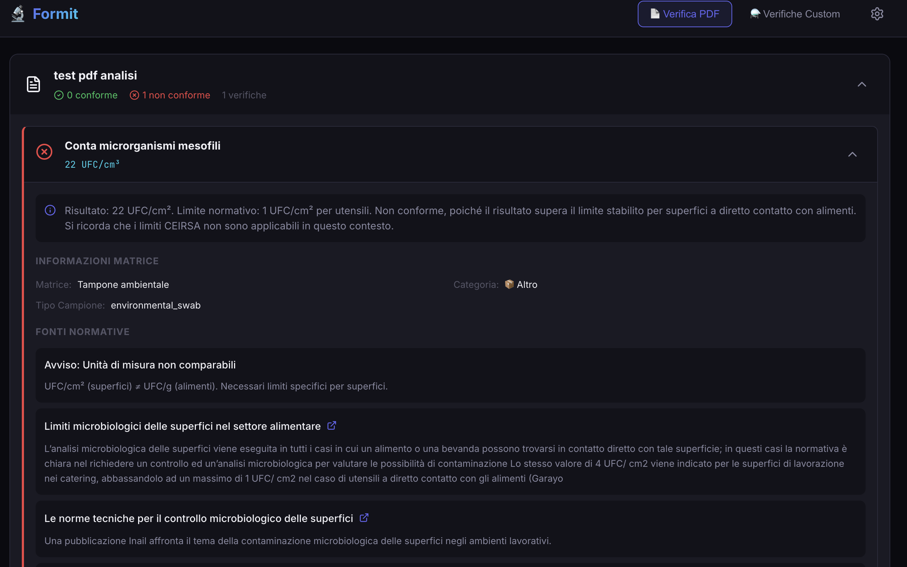
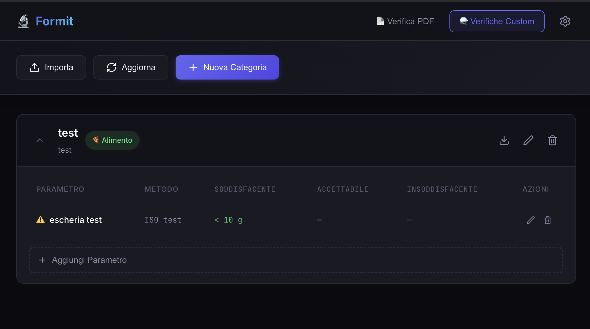
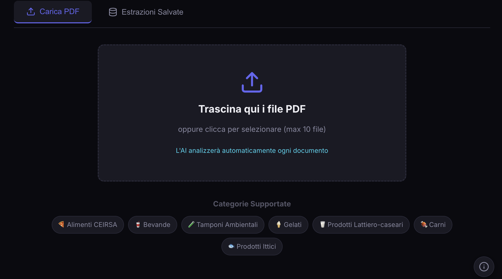

# Formit - Analisi Automatica di Documenti Microbiologici

**Formit** è un'applicazione web che utilizza l'intelligenza artificiale per analizzare automaticamente documenti PDF di analisi microbiologiche e verificare la conformità rispetto ai limiti normativi.

## 🚀 Come Avviare l'Applicazione

### Per Utenti Non Esperti

Avviare Formit è semplicissimo! Basta **un doppio clic** su uno di questi file:

#### Su Windows:
- **Clicca due volte** sul file `start.bat`
- Lo script installerà automaticamente Docker (se necessario) e avvierà l'applicazione

#### Su Mac o Linux:
- **Clicca due volte** sul file `start.sh` (oppure clic destro → Apri con → Terminale)
- Lo script installerà automaticamente Docker (se necessario) e avvierà l'applicazione

### Cosa Succede Quando Avvii l'Applicazione

1. Lo script verifica se Docker è installato sul tuo computer
2. Se Docker non è presente, lo installerà automaticamente (potrebbe richiedere alcuni minuti)
3. Una volta installato Docker, l'applicazione si avvierà automaticamente
4. Dopo qualche secondo, l'applicazione sarà disponibile nel tuo browser all'indirizzo: **http://localhost:3007**

> **Nota**: Se è la prima volta che avvii l'applicazione, l'installazione di Docker potrebbe richiedere alcuni minuti. Dopo la prima installazione, l'avvio sarà molto più veloce.

### Aprire l'Applicazione nel Browser

Dopo aver avviato lo script, apri il tuo browser preferito (Chrome, Firefox, Safari, ecc.) e vai all'indirizzo:

```
http://localhost:3007
```

## 📖 Come Funziona Formit

Formit ti aiuta a verificare automaticamente se i documenti di analisi microbiologiche sono conformi ai limiti normativi. L'applicazione ha due funzionalità principali:

### 1. 📄 Verifica PDF

Questa è la funzionalità principale dell'applicazione. Ti permette di:

- **Caricare uno o più PDF** di analisi microbiologiche (fino a 10 file alla volta, massimo 50MB ciascuno)
- **Analisi automatica**: L'intelligenza artificiale estrae automaticamente:
  - Il tipo di alimento/prodotto analizzato (matrice)
  - La categoria normativa (CEIRSA, bevande, ecc.)
  - I parametri microbiologici con i loro risultati
- **Verifica conformità**: Il sistema confronta automaticamente i risultati con i limiti normativi
- **Visualizzazione risultati**: Vedi immediatamente quali parametri sono conformi e quali no



### 2. ⚗️ Verifiche Custom

Questa funzionalità ti permette di creare categorie personalizzate di verifiche con parametri e limiti definiti da te.

- **Crea categorie personalizzate** per tipi di prodotti specifici
- **Definisci parametri e limiti** secondo le tue esigenze
- **Importa/Esporta** categorie per condividerle o fare backup



## 🖥️ Requisiti di Sistema

- **Windows 10/11**, **macOS 10.15+**, o **Linux** (Ubuntu, Debian, Fedora, ecc.)
- **Docker Desktop** (verrà installato automaticamente dallo script di avvio)
- **4 GB di RAM** disponibili
- **Connessione Internet** (solo per la prima installazione)

## 🛠️ Comandi Utili

### Avviare l'Applicazione
```bash
# Windows
start.bat

# Mac/Linux
./start.sh
```

### Fermare l'Applicazione
Apri un terminale nella cartella del progetto e digita:
```bash
docker compose down
```

### Visualizzare i Log
Per vedere cosa sta succedendo nell'applicazione:
```bash
docker compose logs -f formit-mcp
```

### Riavviare l'Applicazione
```bash
docker compose restart
```

## 📸 Screenshot dell'Applicazione

Durante l'elaborazione dei PDF, vedrai un indicatore di caricamento:



## ❓ Domande Frequenti

### L'applicazione non si avvia, cosa devo fare?

1. Assicurati che Docker Desktop sia in esecuzione (su Windows/Mac, cerca "Docker Desktop" nelle applicazioni)
2. Se Docker non è installato, esegui di nuovo lo script `start.bat` o `start.sh`
3. Controlla che la porta 3007 non sia già utilizzata da un'altra applicazione

### Posso usare l'applicazione senza Internet?

Sì, dopo la prima installazione, l'applicazione funziona completamente offline. L'accesso a Internet è necessario solo per:
- La prima installazione di Docker
- L'aggiornamento dell'applicazione

### Come posso aggiornare l'applicazione?

1. Ferma l'applicazione: `docker compose down`
2. Aggiorna il codice del progetto
3. Riavvia: `./start.sh` o `start.bat`

### I miei dati sono al sicuro?

Sì, tutti i dati vengono salvati localmente sul tuo computer. Nessun dato viene inviato a server esterni.

## 🔧 Per Sviluppatori

Se sei uno sviluppatore e vuoi contribuire o modificare il codice, consulta la sezione tecnica qui sotto.

### Requisiti per lo Sviluppo

- Node.js 20+
- SQLite (incluso nel runtime)
- npm o yarn

### Configurazione

1. Copia il file `.env` di esempio e verifica il valore di `DATABASE_URL` (default `file:./dev.db`)
2. Installa le dipendenze: `npm install`
3. Genera il client Prisma: `npm run prisma:generate`

### Migrazioni Database

- Crea o aggiorna il database locale: `npm run prisma:migrate`
- Apri Prisma Studio per ispezionare i dati: `npm run prisma:studio`

### Esecuzione in Sviluppo

- Ambiente di sviluppo TypeScript: `npm run dev`
- Build di produzione: `npm run build` seguito da `npm run start`
- API in sviluppo: `npm run api:dev`
- Client React in sviluppo: vai nella cartella `client` e esegui `npm run dev`

### Test

Per lanciare i test di integrazione:
```bash
npx vitest run test/integration
```

## 📁 Struttura del Progetto

- `start.sh` / `start.bat`: Script per avviare l'applicazione (per utenti finali)
- `docker-compose.yml`: Configurazione Docker
- `client/`: Applicazione web React (frontend)
- `src/`: Codice sorgente del server (backend)
- `prisma/`: Database e schema dati
- `public/`: Immagini e file statici

## 📞 Supporto

Per problemi o domande, consulta la documentazione tecnica o apri una issue sul repository GitHub.

---

**Formit** - Analisi intelligente di documenti microbiologici
